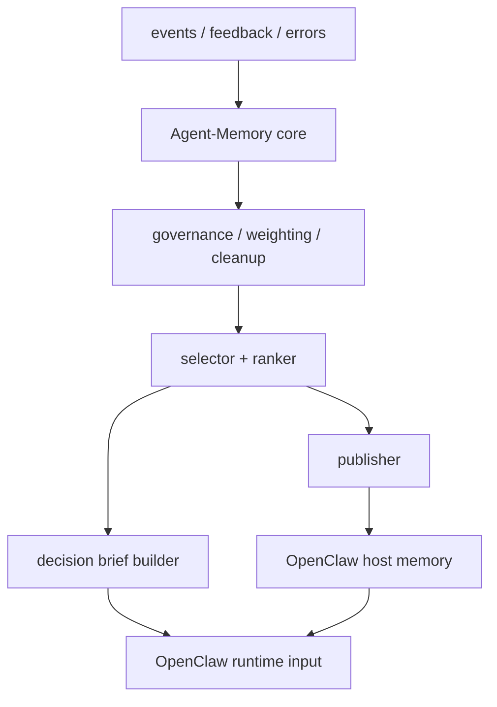

# Decision Layer Design

This document defines the layer that sits between the Agent-Memory core and OpenClaw consumption.

Its purpose is not to replace the storage or learning core. Its purpose is to turn governed memory into decision-ready outputs that OpenClaw can consume with minimal extra reasoning.

## Problem

Today, the core engine can already:

- retrieve strategies, preferences, and error rules
- build an OpenClaw-facing brief
- render a Markdown memory block

That is useful, but it is still close to raw retrieval.

The missing layer is the one that answers:

- which memory items deserve to reach OpenClaw now
- which items should become long-lived host memory
- which items should become short-lived stage memory
- which items should be elevated into a task-start decision brief

In short:

- core engine = source of truth and governance
- decision layer = projection and decision enhancement
- OpenClaw memory = host recall channel

## Scope

This layer is responsible for:

- selecting and ranking governed memory for host consumption
- publishing high-value memory into OpenClaw memory files
- building task-start decision briefs
- deciding when to refresh durable host memory versus task-local briefs

This layer is not responsible for:

- raw event logging
- immediate learning from feedback
- long-term storage ownership
- OpenClaw runtime enforcement

## Design Goal

The design goal is not "send more memory to OpenClaw."

The design goal is:

- send less memory
- send more relevant memory
- send memory in the right shape for decisions

## Layer Position



## Outputs

This layer produces two distinct outputs.

### 1. Host Memory Projection

This is memory published into OpenClaw's own memory channel.

Targets:

- `MEMORY.md` for stable, durable, repeatedly useful guidance
- `memory/YYYY-MM-DD.md` for recent, phase-specific, decaying guidance

This output is optimized for:

- host-side recall
- stable visibility
- reuse across sessions

### 2. Decision Brief

This is a task-start packet built for the current context.

It is optimized for:

- immediate task relevance
- compactness
- actionability

The Decision Brief is not a log and not a raw memory dump.

## Core Components

### 1. Selector / Ranker

Purpose:

- choose what is worth projecting
- rank items for both host publication and task-start use

Inputs:

- current task context
- strategies
- preferences
- error rules
- optional recent-memory summaries

Selection factors:

- context relevance
- historical weight
- stability / durability
- corrective value
- recency

Output shape:

```json
{
  "candidates": [
    {
      "id": "strategy-001",
      "type": "strategy",
      "score": 0.91,
      "reasons": ["task_match", "high_weight", "repeated_success"],
      "target": "brief"
    }
  ]
}
```

### 2. Publisher

Purpose:

- project selected memory into OpenClaw host memory files

Responsibilities:

- map durable items to `MEMORY.md`
- map recent or stage-specific items to `memory/YYYY-MM-DD.md`
- keep projection short and readable
- avoid leaking raw internals like weights, indexes, or event history

Constraints:

- projection is derived state, not source of truth
- publication should be idempotent
- publication should remain bounded

### 3. Decision Brief Builder

Purpose:

- build a task-start packet that gives OpenClaw high-value judgment input

Recommended sections:

- `Priority Preferences`
- `Relevant Strategies`
- `Risk Alerts`
- `Current Focus`

Recommended properties:

- compact
- task-specific
- phrased for action
- internally conflict-resolved before emission

Suggested shape:

```json
{
  "context": {"task": "content_publishing", "workspace": "blog"},
  "priority_preferences": ["Keep answers concise."],
  "relevant_strategies": ["Check local docs before editing tracked docs."],
  "risk_alerts": ["Do not publish raw event history into host memory."],
  "current_focus": ["Improve memory projection quality for OpenClaw."]
}
```

### 4. Sync Policy

Purpose:

- decide when to update durable host memory, recent host memory, and the task-start brief

Required decisions:

- when does a newly learned item become durable enough for `MEMORY.md`
- when should something stay only in daily memory
- when should a task-start brief be regenerated
- when should recent host memory be pruned or replaced

Recommended first-pass policy:

- regenerate Decision Brief on every `session-start`
- publish durable host memory only from high-confidence stable items
- publish daily memory from recent high-value items with strong context relevance
- avoid rewriting host memory on every single event unless explicitly requested

## Separation Of Concerns

The layer must preserve this boundary:

- Agent-Memory core owns learning, storage, and governance
- the decision layer owns projection and packaging
- OpenClaw owns runtime execution and final reasoning

OpenClaw should not need to:

- read Agent-Memory YAML files directly
- inspect internal indexes
- understand cleanup rules
- interpret raw event streams

## Relationship To Current Implementation

The current code already contains the first draft of this layer:

- `retrieve_memory()` provides unified retrieval
- `build_decision_brief()` provides the first structured task-start packet
- `build_openclaw_brief()` wraps raw retrieval, Decision Brief output, and projection metadata
- `render_openclaw_memory()` renders both a Decision Brief section and backward-compatible memory sections
- `publish_openclaw_memory()` writes durable and recent host-memory projections

This means the first implementation slice is no longer hypothetical. It exists and is usable in a local personal OpenClaw workflow.

## What Works Today

The current implementation can already do the following:

- rank memory candidates with lightweight context and weight signals
- build a structured Decision Brief with:
  - `Priority Preferences`
  - `Relevant Strategies`
  - `Risk Alerts`
  - `Current Focus`
- render a prompt-ready Markdown block for OpenClaw session start
- publish stable memory into `MEMORY.md`
- publish recent or stage-specific memory into `memory/YYYY-MM-DD.md`
- expose the same behavior through the core API, adapter, and CLI

In practice, this is sufficient for a personal OpenClaw setup where memory injection and host-memory publication are explicit workflow steps.

## What Is Not Yet Fully Hardened

The current implementation is intentionally narrow and still has clear limits:

- selector / ranker logic is heuristic, not semantic
- sync policy is basic and explicit-call driven
- host-memory publishing currently rewrites derived files rather than performing sophisticated merges
- conflict handling between competing memory items is still lightweight
- publication policy is stable enough for local usage, but not yet tuned for multi-agent or heavily concurrent workflows

So the layer is usable, but it should still be thought of as an initial implementation rather than a finalized projection engine.

## Proposed Internal Contracts

The next implementation iteration should aim for a contract like this:

```python
select_projection(context, limit_per_type=3) -> ProjectionSet
build_decision_brief(context, limit_per_type=3) -> DecisionBrief
render_decision_brief(context, format="markdown") -> str
publish_openclaw_memory(context=None, mode="incremental") -> PublishResult
```

Possible data objects:

- `ProjectionSet`: ranked candidates with publication targets
- `DecisionBrief`: structured task-start packet
- `PublishResult`: changed files, published item ids, and skipped ids

## First Implementation Slice

The first implementation should stay narrow.

### Phase 1

- refactor the current brief builder into a structured Decision Brief
- keep retrieval rules simple and inspectable
- preserve the existing adapter and CLI surfaces

Status: completed as the initial implementation slice.

### Phase 2

- add a publisher that writes durable and recent host memory projections
- define bounded templates for `MEMORY.md` and daily memory files

Status: initial implementation completed; hardening remains.

### Phase 3

- add explicit sync policy and publication tests
- add support for publish previews / dry runs

Status: partially completed through initial publication tests; explicit sync policy hardening and preview mode remain.

## Stronger Next Upgrades

The next meaningful upgrades for this layer are:

- better ranking and relevance scoring
- stronger merge/update behavior for host-memory publishing
- explicit sync policy beyond basic explicit-call flow
- dry-run / preview support for publishing
- stronger conflict resolution before projection
- clearer durability promotion rules from recent memory into `MEMORY.md`

## Non-Goals For This Design

This design does not assume:

- OpenClaw runtime hooks
- forced consumption by OpenClaw
- plugin infrastructure
- semantic/vector retrieval

Those can be added later without changing the role of this layer.

## Summary

The decision layer is the bridge between governed memory and better agent decisions.

It exists so that Agent-Memory does not merely store experience. It turns experience into the specific, bounded, decision-ready guidance that OpenClaw can actually use.
