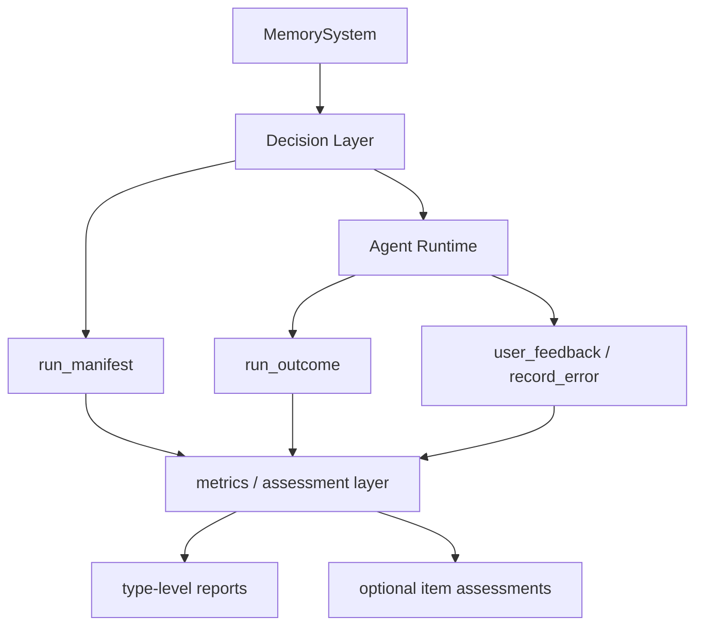

# Metrics Layer Design

This document defines a bounded effectiveness and observability layer for Agent-Memory.

Its purpose is not to prove what the runtime "thought." Its purpose is to answer a narrower and more useful question:

- did the runtime receive governed memory
- what happened later in the same run
- did runs that exposed certain memory types look healthier over time
- for a small number of linkable cases, did a correction clearly contradict an exposed memory item

This layer must stay cheap enough for local personal workflows and trustworthy enough to avoid false item-level conclusions.

## Problem

Today, Agent-Memory can already:

- log events
- learn strategies, preferences, and rules
- build Decision Briefs
- publish host-memory projections

What it cannot yet answer well is:

- is the memory system actually helping
- which memory types are associated with fewer corrections or fewer errors
- which exposed memory items were clearly contradicted by later feedback

The obvious but wrong answer would be to analyze the entire runtime process in depth.

That approach is too expensive and too open-ended:

- it pushes the system toward full transcript analysis
- it encourages unlimited evidence collection
- it creates fragile item-level judgments
- it raises engineering cost faster than practical value

## Design Goal

The goal is not "perfect attribution."

The goal is:

- bounded run-level observability
- low-cost effectiveness reporting
- cautious item-level assessment only when evidence is strong enough

## Core Principles

### 1. Run-Bounded Observability

The primary unit is a single run identified by a `trace_id`.

The metrics layer should not require whole-history replay. It should only need:

- what was exposed during this run
- what happened later in this run
- a small observation window for closure

### 2. Explicit Events Before Inference

The first implementation should rely on explicit lifecycle events before introducing inference:

- `session_start`
- `task_complete`
- `user_feedback`
- `record_error`

If an explicit event exists, use it before reaching for text interpretation or tool-trace analysis.

### 3. Run-Level First, Item-Level Later

The first question is:

- did runs with exposed memory look healthier than runs without it

Only after that should the system attempt item-level judgments such as:

- this correction likely contradicted preference `X`
- this rule likely prevented a repeated failure

### 4. Unresolved By Default

When evidence is insufficient, the correct answer is not a forced positive or negative judgment.

The correct answer is:

- `unresolved`
- `insufficient_evidence`

This is especially important when a run contains a correction that may target memory item `B` while memory item `A` was also exposed.

### 5. Limited Domains Before General Text Understanding

Early item-level linking should only exist for narrow, high-value domains where rules are inspectable:

- communication style
- output contracts and structured format requirements
- evidence-first workflows such as logs-first, docs-first, and "do not guess"
- safety or hard constraints only when the rule is stable and easy to verify

This design does not assume general-purpose natural-language understanding.

## Layer Position



## Scope

This layer is responsible for:

- recording which memory was exposed in a run
- recording whether a run later produced correction or error signals
- computing bounded type-level effectiveness metrics
- optionally producing cautious item-level assessments for a small set of rule-driven domains

This layer is not responsible for:

- full transcript storage
- full tool-trace analysis by default
- proving runtime consumption
- proving causality for every memory item
- replacing the event store or governance core

## Relationship To Current Implementation

The first bounded slice now exists in the repository:

- `metrics_layer.py` records `RunManifest` and `RunOutcome`
- `runtime_integration.py` creates a `trace_id` during `session_start`
- lifecycle calls update run outcomes through task completion, user feedback, and error recording
- `report_metrics()` / `metrics-report` provide local type-level reports

Current boundary:

- item-level assessment is intentionally limited to a few high-leverage categories
- current supported categories are:
  - `communication_style`
  - `output_contract`
  - `workflow.evidence_first`

## Observation Window

Recommended default:

- open a run at `session_start`
- keep recording until `task_complete`
- allow direct follow-up `user_feedback` or `record_error` for the same `trace_id`
- close the run when the next `session_start` begins or when an explicit close happens

This keeps the system bounded and avoids open-ended waiting for future evidence.

## Data Objects

### 1. RunManifest

Purpose:

- record what the runtime received at task start

Suggested shape:

```json
{
  "trace_id": "run-20260314-001",
  "started_at": "2026-03-14T10:00:00+08:00",
  "bucket": "content_publishing|blog|chat",
  "context": {
    "task": "content_publishing",
    "workspace": "blog",
    "surface": "chat"
  },
  "exposed_memory_ids": ["strategy-12", "preference-7"],
  "exposed_memory_types": ["strategy", "preference"],
  "memory_count_by_type": {
    "strategy": 1,
    "preference": 1,
    "rule": 0
  },
  "decision_brief_non_empty": true
}
```

### 2. RunOutcome

Purpose:

- record what happened later in the same run

Suggested shape:

```json
{
  "trace_id": "run-20260314-001",
  "closed_at": "2026-03-14T10:08:00+08:00",
  "outcome_class": "corrected_run",
  "task_outcome": "success",
  "has_correction": true,
  "has_error": false,
  "task_complete_seen": true,
  "feedback_events": ["event-302"],
  "error_events": []
}
```

Recommended `outcome_class` values:

- `clean_run`
- `corrected_run`
- `error_run`
- `corrected_and_error`

### 3. Assessment

Purpose:

- store optional item-level judgments only when enough evidence exists

Suggested shape:

```json
{
  "trace_id": "run-20260314-001",
  "memory_id": "preference-7",
  "status": "likely_contradicted",
  "reason": "same_category_and_matching_facets",
  "confidence": 0.82,
  "evidence": ["feedback:verbose", "action:long_answer"]
}
```

Recommended status values:

- `unresolved`
- `likely_contradicted`
- `likely_helpful`
- `insufficient_evidence`

Important boundary:

- a run-level correction does not automatically mark all exposed memory as contradicted
- if a correction cannot be linked to memory item `A`, item `A` remains `unresolved`

### 4. Type-Level Report

Purpose:

- summarize health signals by memory type, not by individual item

Suggested shape:

```json
{
  "window": "7d",
  "total_runs": 128,
  "by_memory_type": {
    "preference": {
      "exposed_runs": 42,
      "clean_run_rate": 0.71,
      "correction_rate": 0.19,
      "error_rate": 0.07,
      "success_rate": 0.88
    },
    "strategy": {
      "exposed_runs": 51,
      "clean_run_rate": 0.49,
      "correction_rate": 0.36,
      "error_rate": 0.21,
      "success_rate": 0.72
    },
    "rule": {
      "exposed_runs": 33,
      "clean_run_rate": 0.79,
      "correction_rate": 0.15,
      "error_rate": 0.06,
      "success_rate": 0.91
    },
    "none": {
      "runs": 27,
      "clean_run_rate": 0.41,
      "correction_rate": 0.41,
      "error_rate": 0.18,
      "success_rate": 0.67
    }
  }
}
```

Readable consumption guidance:

- the JSON report should include a `summary` block for quick inspection
- the JSON report should include a bounded `by_bucket` comparison section
- the `summary` block should include:
  - a short verdict
  - one positive signal
  - a short watchout list
- the CLI should support a human-readable text view for local workflows
- the text view is derived output, not a separate source of truth

## Metrics

The first implementation should focus on metrics that are cheap and bounded.

### Type-Level Metrics

For each memory type:

- `exposed_runs`
- `clean_run_rate`
- `correction_rate`
- `error_rate`
- `success_rate`

Recommended formulas:

```text
correction_rate(type) =
  corrected_runs_with_type / total_runs_with_type

error_rate(type) =
  error_runs_with_type / total_runs_with_type

success_rate(type) =
  successful_runs_with_type / total_runs_with_type

clean_run_rate(type) =
  clean_runs_with_type / total_runs_with_type
```

Grouping guidance:

- compare within a `bucket`, not across unrelated workloads
- a `bucket` should be derived from stable runtime context such as task, workspace, and surface

## Linking Policy For Item-Level Assessment

Item-level assessment should be narrow and explicit.

### Rule 1: Only Compare Against Exposed Memory

If a run exposed:

- `strategy-a`
- `preference-b`

and later a correction appears, only those exposed items are candidates for linking.

Do not search the whole memory store.

### Rule 2: Missing Link Evidence Is Not Negative Proof

If a correction appears but cannot be linked strongly enough to item `A`, do not mark item `A` as failed.

Mark item `A` as:

- `unresolved`

Preferred reason values:

- `no_sufficient_link_evidence`
- `insufficient_signal`
- `multiple_weak_candidates`

### Rule 3: Narrow Linking Domains First

The first implementation should only support item-level linking for a small set of categories:

- `communication_style`
- `output_contract`
- `workflow.evidence_first`

### Rule 4: Favor Contradiction Before Helpfulness

It is usually easier to say:

- a correction clearly contradicted this memory

than to say:

- this memory definitely helped

So early item-level status should prioritize `likely_contradicted`. `likely_helpful` should require repeated clean runs or stronger follow-up evidence.

## Storage Recommendation

Suggested local files:

- `metrics/run-manifests.jsonl`
- `metrics/run-outcomes.jsonl`
- `metrics/assessments.jsonl`

Optional generated outputs:

- `metrics/reports/latest.json`
- `metrics/reports/YYYY-MM-DD.json`

These files are derived observability data. They are not the source of truth for learning or retrieval.

## First Implementation Slice

The first implementation should stay intentionally small.

### Phase 1: Run-Level And Type-Level Metrics

Record:

- `RunManifest` on `session_start`
- `RunOutcome` updates on `task_complete`, `user_feedback`, and `record_error`

Compute:

- type-level correction, error, success, and clean-run rates
- comparison between runs with memory exposure and runs without it

Do not implement yet:

- item-level correction linker
- full evidence extraction
- transcript analysis
- tool-trace rules

### Phase 2: Limited Item-Level Assessment

Add:

- a bounded correction linker
- narrow category-based linking
- `Assessment` records for a few high-value cases

Keep the following guardrails:

- compare only against exposed memory in the same run
- leave items `unresolved` when link evidence is weak
- do not emit strong words such as `effective` or `ineffective`
- prefer high-leverage, cross-task categories over low-value demo rules

### Phase 3: Optional Rich Evidence Plugins

Only if a runtime exposes richer traces, support optional evidence plugins such as:

- read-before-edit checks
- validation-before-publish checks
- repeated-error suppression checks

These should remain optional enhancements, not required for baseline metrics.

## Non-Goals

This design explicitly avoids:

- a full process replay system
- mandatory full-transcript capture
- unbounded observation windows
- all-memory global attribution
- heavy natural-language understanding as a prerequisite for reporting

## Summary

The metrics layer exists to answer whether Agent-Memory is helping without turning Agent-Memory into a full analytics platform.

Its first job is simple:

- record what was exposed
- record what happened later
- report whether runs with memory look healthier

Its second job, later and only in bounded domains, is to make careful item-level judgments without pretending to know more than the evidence supports.
